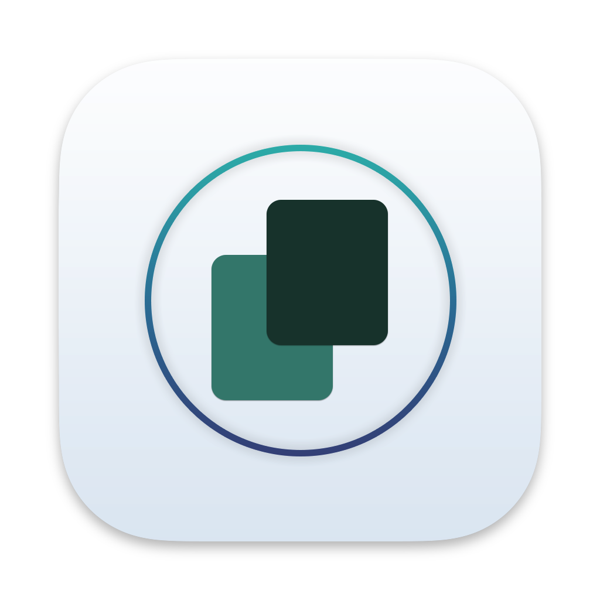

   

# Clipy

[Yet another clipboard manager](#yet-another-clipboard-manager) for macOS. Clipy is a modern menu bar app that will save
your copy history and let you access it on the fly. It has native Apple silicon support and is written in pure Swift.

Supports macOS 14 (Sonoma) and above.

## Install

Clipy is in active development and only available in beta, if you're ok with that then grab the latest version from 
[releases](https://github.com/MiralDesai/Clipy/releases/latest)

## Yet another clipboard manager

> Why another clipboard manager app when there are already so many?

I've been a big fan, and daily user of [Clipy/Clipy](https://github.com/clipy/Clipy) for the last 3-4 years but noticed 
the project was no longer being maintained. So I thought it would be a good opportunity to learn a new language 
and attempt to make something similar, for the Apple silicon era of macs. It's also why this app has the same name, as a 
nod to the original version. My app shares no code with the original. 
